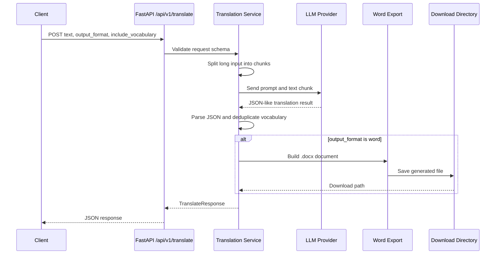
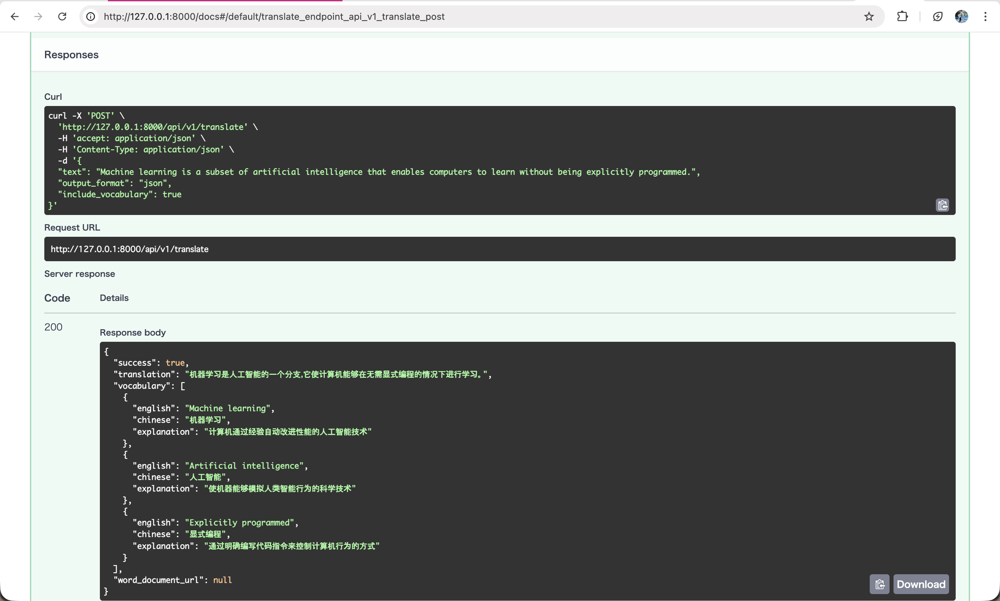
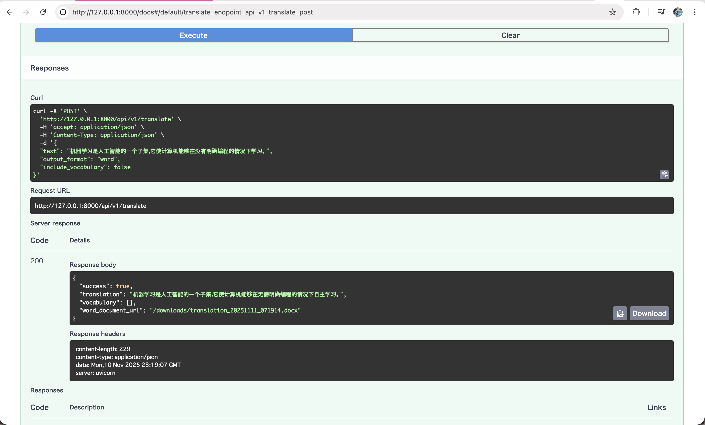

# SpeechX / LingoTask

SpeechX is the portfolio repository. `lingotask` is the current implemented module inside it: a small FastAPI service for English-to-Chinese technical translation with LLM prompting, vocabulary extraction, optional Word export, and tests around deterministic service behavior.

The project is intentionally modest. It is not a full speech platform yet. Its value is showing how an LLM feature can be wrapped in a maintainable API surface: request and response schemas, provider calls behind a service layer, chunking for long input, error handling, generated artifacts, and tests that avoid live LLM calls.

## Features

- English-to-Chinese translation for technical text.
- Vocabulary extraction with Chinese explanations.
- Optional `.docx` export for translated output.
- FastAPI API under `/api/v1/translate`.
- Prompt definition in `src/lingotask/prompts.py`.
- Configurable DeepSeek-compatible provider settings through environment variables.
- Pytest coverage for non-LLM service behavior.

## Architecture

```text
Client
  -> FastAPI router
  -> translation service
  -> LLM client
  -> JSON extraction and schema normalization
  -> optional Word document builder
  -> response payload
```



## Project Layout

```text
src/
├── lingotask/
│   ├── app/
│   │   ├── config.py
│   │   ├── exceptions.py
│   │   ├── llm.py
│   │   ├── main.py
│   │   ├── middleware.py
│   │   ├── schemas.py
│   │   └── services/
│   │       ├── translation.py
│   │       └── word_export.py
│   ├── prompts.py
│   ├── requirements.txt
│   └── sample.txt
└── tests/
    └── test_translate.py
```

## Run Locally

```bash
python -m venv .venv
source .venv/bin/activate
pip install -r src/lingotask/requirements.txt

cp src/lingotask/.env.example src/lingotask/.env
# Fill DEEPSEEK_API_KEY in src/lingotask/.env or export it in your shell.

cd src/lingotask
uvicorn app.main:app --reload
```

Then open:

- API docs: `http://127.0.0.1:8000/docs`
- Sample input: `src/lingotask/sample.txt`

## API Example

Request:

```http
POST /api/v1/translate
Content-Type: application/json
```

```json
{
  "text": "Machine learning systems need reliable evaluation and monitoring.",
  "output_format": "json",
  "include_vocabulary": true
}
```

Response shape:

```json
{
  "success": true,
  "translation": "...",
  "vocabulary": [
    {
      "english": "Machine learning",
      "chinese": "...",
      "explanation": "..."
    }
  ],
  "word_document_url": null
}
```

For Word export, set `output_format` to `word`. The response includes `word_document_url` when document generation succeeds.

## Test

```bash
source .venv/bin/activate
PYTHONPATH=src/lingotask pytest src/tests
```

The tests monkeypatch the LLM call and focus on deterministic behavior: request handling, vocabulary behavior, and Word export wiring. They do not call the live provider.

## Configuration

The service reads configuration from environment variables or `.env`:

- `DEEPSEEK_API_KEY`: provider API key.
- `DEEPSEEK_BASE_URL`: provider base URL, default `https://api.deepseek.com`.
- `DEEPSEEK_MODEL`: model name, default `deepseek-chat`.
- `APP_DOWNLOAD_DIR`: local directory for generated documents.
- `MAX_TEXT_CHARS`: threshold for chunking long input.
- `REQUEST_TIMEOUT_SECONDS`: provider request timeout.
- `RETRY_MAX_ATTEMPTS`: retry count for upstream failures.
- `RETRY_BACKOFF_SECONDS`: fixed retry delay.

## Production Considerations

This repository is a compact LLM application example, not a production deployment. The current code already exposes some production-relevant seams, but several areas need hardening before real use:

- **Secrets:** API keys are read from environment variables. Do not commit real keys or service credentials.
- **Timeouts:** provider calls use an HTTP timeout from `REQUEST_TIMEOUT_SECONDS`.
- **Retries:** upstream calls retry with a fixed backoff. A production service should add jitter, retry budgets, and clearer retry telemetry.
- **Malformed LLM output:** the service extracts JSON from model text and raises an LLM error when parsing fails. More robust structured-output validation would be needed for critical workflows.
- **Max input size:** long text is chunked, but there is no full token accounting, cost estimate, or hard request budget by user.
- **Cost and rate limits:** no per-user rate limiting, quota, or cost tracking is implemented yet.
- **Storage cleanup:** generated Word files are stored locally under `APP_DOWNLOAD_DIR`; retention and cleanup are not implemented.
- **Observability gaps:** there is no metrics, tracing, structured request logging, latency dashboard, or provider failure taxonomy yet.

## Known Limitations

- The implemented module is translation-focused; audio or speech-to-speech workflows are outside the current scope.
- LLM quality is not evaluated with a golden dataset.
- There is no Dockerfile, CI workflow, or deployment runbook in this repository yet.
- Provider behavior is abstracted only lightly; the current client targets a DeepSeek-compatible chat completions API.

## Screenshots




